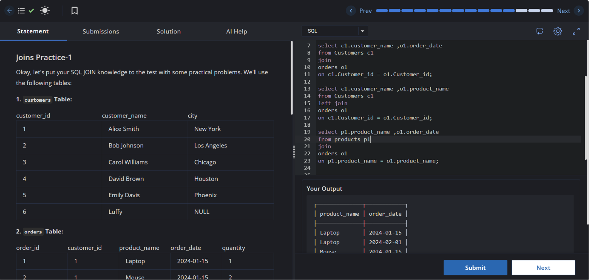

# Experiment 4.1

**Name:** Bhavesh Chawla  
**UID:** 24BCS10079

## Aim

To practice basic SQL `JOIN` operations using sample `Customers`, `Orders`, and `Products` tables.

## Question

Write SQL queries to:
1. Retrieve customer names and order dates using an inner join between `Customers` and `Orders`.
2. Retrieve customer names and product names using a left join between `Customers` and `Orders`.
3. Retrieve product names and order dates using a join between `Products` and `Orders`.

## SQL Queries Used

```sql
SELECT c1.customer_name, o1.order_date
FROM Customers c1
JOIN Orders o1
    ON c1.customer_id = o1.customer_id;

SELECT c1.customer_name, o1.product_name
FROM Customers c1
LEFT JOIN Orders o1
    ON c1.customer_id = o1.customer_id;

SELECT p1.product_name, o1.order_date
FROM Products p1
JOIN Orders o1
    ON p1.product_name = o1.product_name;
```

## Output

The output shows the results returned by the join queries. The first query returns customer names with order dates. The second query returns customer names with product names and retains unmatched customers. The third query returns products paired with order dates when matching `Orders` rows exist.

## Output Screenshot



## Image Explanation

The screenshot displays the SQL editor and query results for the join exercises. It shows the executed join statements and the combined result set from the sample tables.

## Result

The `JOIN` and `LEFT JOIN` queries executed successfully, demonstrating how SQL combines rows from related tables.
