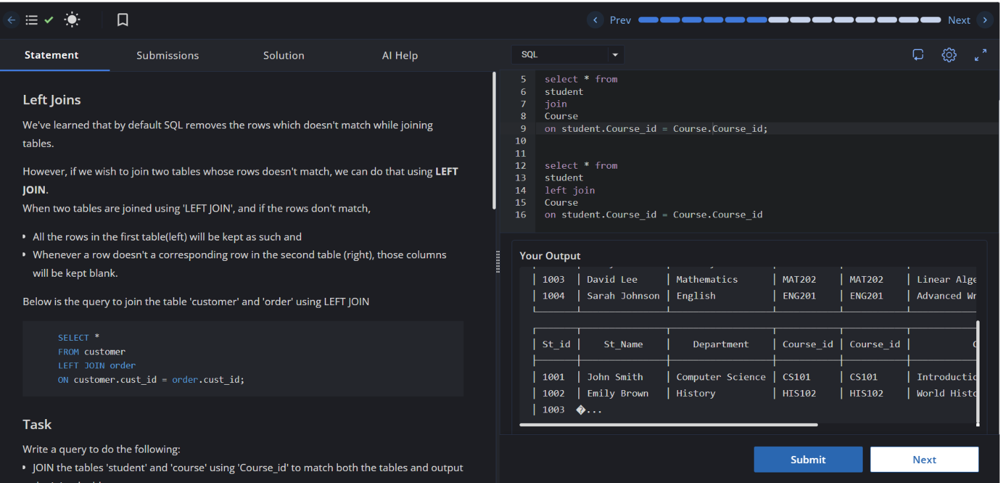

# Experiment 4.2

**Name:** Bhavesh Chawla  
**UID:** 24BCS10079

## Aim

To demonstrate the difference between standard `JOIN` and `LEFT JOIN` using the `student` and `Course` tables.

## Question

Write SQL queries to:
1. Join `student` and `Course` on `Course_id`.
2. Use `LEFT JOIN` to include all `student` rows and show course details when available.

## SQL Queries Used

```sql
SELECT *
FROM student
JOIN Course
    ON student.Course_id = Course.Course_id;

SELECT *
FROM student
LEFT JOIN Course
    ON student.Course_id = Course.Course_id;
```

## Output

The first query returns only matching student-course rows. The second query returns all students and includes course details where a match exists, leaving course columns blank for students without a corresponding course.

## Output Screenshot



## Image Explanation

The screenshot shows the SQL editor and the output of the join queries. It illustrates how `LEFT JOIN` preserves all rows from the left table while matching course details when available.

## Result

The join queries were executed successfully, showing the expected behavior of `JOIN` and `LEFT JOIN`.
