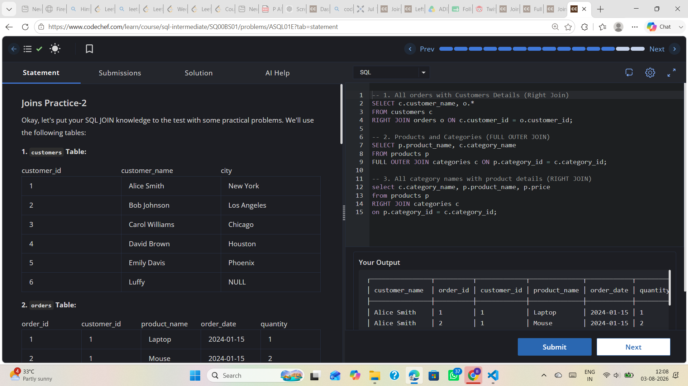

# Experiment 4.3

**Name:** Bhavesh Chawla  
**UID:** 24BCS10079

## Aim

To practice `RIGHT JOIN` and `FULL OUTER JOIN` operations using sample `customers`, `orders`, `products`, and `categories` tables.

## Question

Write SQL queries to:
1. Retrieve all orders with customer details using `RIGHT JOIN`.
2. Combine products and categories using `FULL OUTER JOIN`.
3. Retrieve all category names with product details using `RIGHT JOIN`.

## SQL Queries Used

```sql
SELECT c.customer_name, o.*
FROM customers c
RIGHT JOIN orders o
    ON c.customer_id = o.customer_id;

SELECT p.product_name, c.category_name
FROM products p
FULL OUTER JOIN categories c
    ON p.category_id = c.category_id;

SELECT c.category_name, p.product_name, p.price
FROM products p
RIGHT JOIN categories c
    ON p.category_id = c.category_id;
```

## Output

The output shows the result of each join operation. The `RIGHT JOIN` query returns all orders and attached customer details. The `FULL OUTER JOIN` query returns all products and categories, including unmatched rows. The final `RIGHT JOIN` query returns every category with product information when available.

## Output Screenshot



## Image Explanation

The screenshot shows the SQL editor and query output for the `RIGHT JOIN` and `FULL OUTER JOIN` exercises. It confirms that the join operations returned the expected combined records.

## Result

The `RIGHT JOIN` and `FULL OUTER JOIN` queries executed successfully, demonstrating how to include unmatched rows from the right and both tables.
