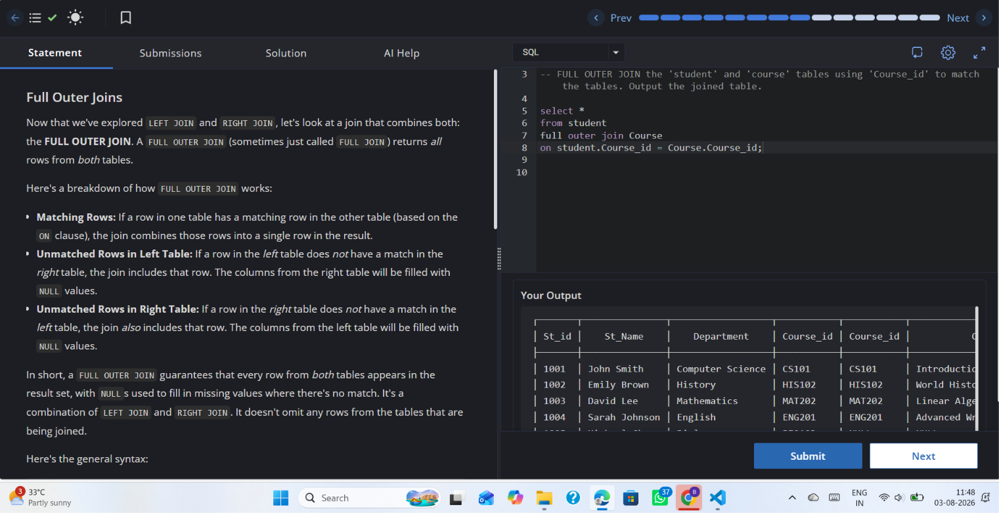

# Experiment 4.4

**Name:** Bhavesh Chawla  
**UID:** 24BCS10079

## Aim

To understand the `FULL OUTER JOIN` operation by combining all rows from the `student` and `Course` tables.

## Question

Write an SQL query that performs a `FULL OUTER JOIN` between `student` and `Course` on `Course_id`, and display all rows from both tables.

## SQL Queries Used

```sql
SELECT *
FROM student
FULL OUTER JOIN Course
    ON student.Course_id = Course.Course_id;
```

## Output

The output includes every row from both the `student` and `Course` tables. Matching rows are combined, and unmatched rows from either table are included with `NULL` values in the missing columns.

## Output Screenshot



## Image Explanation

The screenshot displays the SQL editor and the result of the `FULL OUTER JOIN` query. It demonstrates that the join returns all rows from both tables while preserving unmatched rows from each side.

## Result

The `FULL OUTER JOIN` query executed successfully, showing the combined data from both tables along with unmatched rows.
