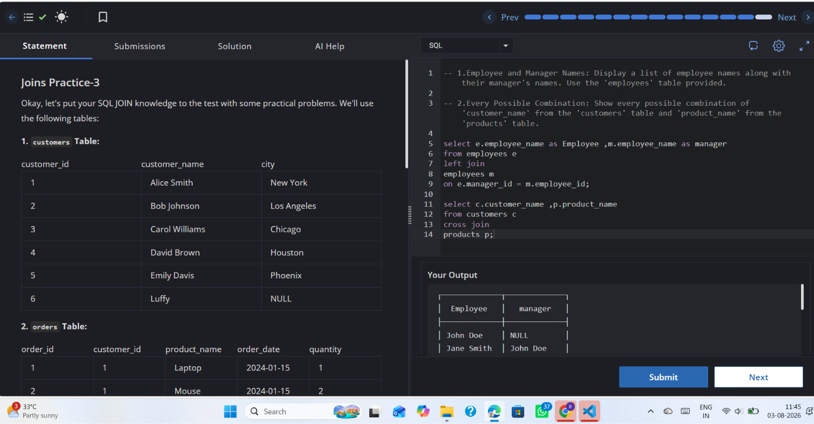

# Experiment 4.5

**Name:** Bhavesh Chawla  
**UID:** 24BCS10079

## Aim

To practice advanced join operations including self-join and cross join with sample tables.

## Question

Write SQL queries to:
1. Display employee and manager pairs using a self-join on `employees`.
2. Display every possible combination of `customer_name` and `product_name` using `CROSS JOIN`.

## SQL Queries Used

```sql
SELECT e.employee_name AS Employee,
       m.employee_name AS Manager
FROM employees e
LEFT JOIN employees m
    ON e.manager_id = m.employee_id;

SELECT c.customer_name, p.product_name
FROM customers c
CROSS JOIN products p;
```

## Output

The self-join query returns each employee together with their manager name, including employees without a manager. The `CROSS JOIN` query returns all possible combinations of customers and products.

## Output Screenshot



## Image Explanation

The screenshot shows the SQL editor and the output for the self-join and cross join queries. It illustrates hierarchical employee-manager relationships and the Cartesian product of customers and products.

## Result

The self-join and `CROSS JOIN` queries executed successfully, demonstrating how to compare rows within the same table and how to generate all combinations across two tables.
