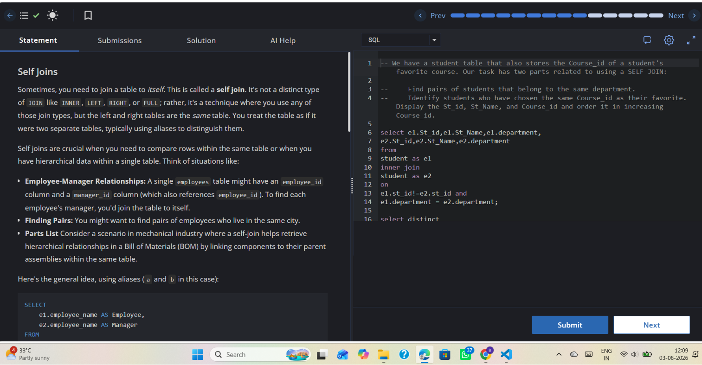

# Experiment 4.6

**Name:** Bhavesh Chawla  
**UID:** 24BCS10079

## Aim

To practice using a self-join to compare rows within the same table and identify student pairs in the same department.

## Question

Write an SQL query that joins the `student` table to itself and finds pairs of students who belong to the same department.

## SQL Queries Used

```sql
SELECT e1.St_id, e1.St_Name, e1.department,
       e2.St_id, e2.St_Name, e2.department
FROM student AS e1
INNER JOIN student AS e2
    ON e1.st_id != e2.st_id
   AND e1.department = e2.department;
```

## Output

The output displays pairs of students who share the same department. Each matched pair appears with both student IDs, names, and departments.

## Output Screenshot



## Image Explanation

The screenshot shows the SQL editor and the self-join query output. It confirms that the self-join returns rows from the same table where the department values match.

## Result

The self-join query executed successfully, demonstrating how to compare rows within a single table using table aliases.
