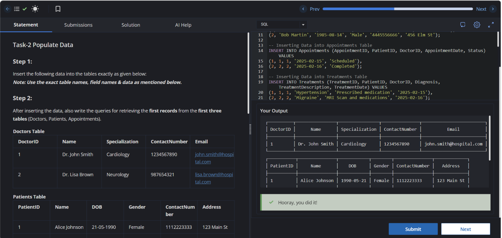

# Experiment 1

**Name:** Bhavesh Chawla  
**UID:** 24BCS10079

## Aim

To insert the provided records into the Hospital Management System database tables and verify the inserted data by retrieving the first record from the Doctors, Patients, and Appointments tables.

---

## Question

### Step 1
Insert the given records into the respective database tables using SQL `INSERT` statements.

### Step 2
Write SQL queries to display the first record from the **Doctors**, **Patients**, and **Appointments** tables after the data has been inserted successfully.

---

## Doctors Table

| DoctorID | Name | Specialization | ContactNumber | Email |
|----------|----------------|----------------|---------------|-------------------------|
| 1 | Dr. John Smith | Cardiology | 1234567890 | john.smith@hospital.com |
| 2 | Dr. Lisa Brown | Neurology | 0987654321 | lisa.brown@hospital.com |

## Patients Table

| PatientID | Name | DOB | Gender | ContactNumber | Address |
|-----------|---------------|------------|--------|---------------|-------------|
| 1 | Alice Johnson | 1990-05-21 | Female | 1112223333 | 123 Main St |
| 2 | Bob Martin | 1985-08-14 | Male | 4445556666 | 456 Elm St |

## Appointments Table

| AppointmentID | PatientID | DoctorID | AppointmentDate | Status |
|---------------|-----------|----------|-----------------|-----------|
| 1 | 1 | 1 | 2025-02-15 | Scheduled |
| 2 | 2 | 2 | 2025-02-16 | Completed |

## Treatments Table

| TreatmentID | PatientID | DoctorID | Diagnosis | TreatmentDescription | TreatmentDate |
|-------------|-----------|----------|-----------|----------------------|---------------|
| 1 | 1 | 1 | Hypertension | Prescribed medication | 2025-02-15 |
| 2 | 2 | 2 | Migraine | MRI Scan and medications | 2025-02-16 |

## MedicalRecords Table

| RecordID | PatientID | TreatmentID | Notes |
|----------|-----------|-------------|--------------------------------------|
| 1 | 1 | 1 | Patient responding well to treatment |
| 2 | 2 | 2 | Further evaluation required |

## Billing Table

| BillID | PatientID | TreatmentID | Amount | BillDate | Status |
|--------|-----------|-------------|--------|------------|---------|
| 1 | 1 | 1 | 200.00 | 2025-02-15 | Paid |
| 2 | 2 | 2 | 500.00 | 2025-02-16 | Unpaid |

---

# SQL Queries Used

## Insert into Doctors

```sql
INSERT INTO Doctors (DoctorID, Name, Specialization, ContactNumber, Email)
VALUES
(1, 'Dr. John Smith', 'Cardiology', '1234567890', 'john.smith@hospital.com'),
(2, 'Dr. Lisa Brown', 'Neurology', '0987654321', 'lisa.brown@hospital.com');
```

## Insert into Patients

```sql
INSERT INTO Patients (PatientID, Name, DOB, Gender, ContactNumber, Address)
VALUES
(1, 'Alice Johnson', '1990-05-21', 'Female', '1112223333', '123 Main St'),
(2, 'Bob Martin', '1985-08-14', 'Male', '4445556666', '456 Elm St');
```

## Insert into Appointments

```sql
INSERT INTO Appointments (AppointmentID, PatientID, DoctorID, AppointmentDate, Status)
VALUES
(1, 1, 1, '2025-02-15', 'Scheduled'),
(2, 2, 2, '2025-02-16', 'Completed');
```

## Insert into Treatments

```sql
INSERT INTO Treatments (TreatmentID, PatientID, DoctorID, Diagnosis, TreatmentDescription, TreatmentDate)
VALUES
(1, 1, 1, 'Hypertension', 'Prescribed medication', '2025-02-15'),
(2, 2, 2, 'Migraine', 'MRI Scan and medications', '2025-02-16');
```

## Insert into MedicalRecords

```sql
INSERT INTO MedicalRecords (RecordID, PatientID, TreatmentID, Notes)
VALUES
(1, 1, 1, 'Patient responding well to treatment'),
(2, 2, 2, 'Further evaluation required');
```

## Insert into Billing

```sql
INSERT INTO Billing (BillID, PatientID, TreatmentID, Amount, BillDate, Status)
VALUES
(1, 1, 1, 200.00, '2025-02-15', 'Paid'),
(2, 2, 2, 500.00, '2025-02-16', 'Unpaid');
```

## Retrieve First Record from Doctors

```sql
SELECT * FROM Doctors
WHERE DoctorID = 1;
```

## Retrieve First Record from Patients

```sql
SELECT * FROM Patients
WHERE PatientID = 1;
```

## Retrieve First Record from Appointments

```sql
SELECT * FROM Appointments
WHERE AppointmentID = 1;
```

---

# Output

### Doctors

```text
┌──────────┬────────────────┬────────────────┬───────────────┬─────────────────────────┐
│ DoctorID │      Name      │ Specialization │ ContactNumber │          Email          │
├──────────┼────────────────┼────────────────┼───────────────┼─────────────────────────┤
│ 1        │ Dr. John Smith │ Cardiology     │ 1234567890    │ john.smith@hospital.com │
└──────────┴────────────────┴────────────────┴───────────────┴─────────────────────────┘
```

### Patients

```text
┌───────────┬───────────────┬────────────┬────────┬───────────────┬─────────────┐
│ PatientID │     Name      │    DOB     │ Gender │ ContactNumber │   Address   │
├───────────┼───────────────┼────────────┼────────┼───────────────┼─────────────┤
│ 1         │ Alice Johnson │ 1990-05-21 │ Female │ 1112223333    │ 123 Main St │
└───────────┴───────────────┴────────────┴────────┴───────────────┴─────────────┘
```

### Appointments

```text
┌───────────────┬───────────┬──────────┬─────────────────┬───────────┐
│ AppointmentID │ PatientID │ DoctorID │ AppointmentDate │  Status   │
├───────────────┼───────────┼──────────┼─────────────────┼───────────┤
│ 1             │ 1         │ 1        │ 2025-02-15      │ Scheduled │
└───────────────┴───────────┴──────────┴─────────────────┴───────────┘
```

---

## Output Screenshot



---

## Image Explanation

The screenshot displays the SQL editor after executing all the `INSERT` statements for the six hospital database tables. It also shows the execution of the `SELECT` queries used to retrieve the first record from the **Doctors**, **Patients**, and **Appointments** tables. The successful output confirms that the data was inserted correctly and the retrieval queries worked as expected.

---

## Result

The given records were successfully inserted into all the hospital database tables. The first records from the **Doctors**, **Patients**, and **Appointments** tables were retrieved successfully, confirming that the insertion and retrieval operations were completed without any errors.