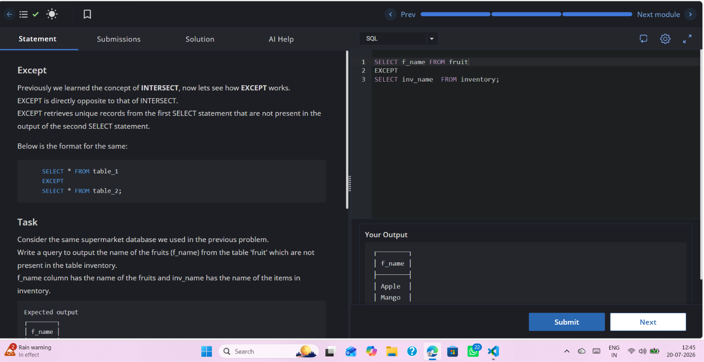

# Experiment 2.4

**Name:** Bhavesh Chawla  
**UID:** 24BCS10079

## Aim

To understand the working of the `EXCEPT` operator in SQL by retrieving the records that are present in the **fruit** table but not in the **inventory** table.

---

## Question

Write an SQL query to display the names of fruits from the **fruit** table that are **not** present in the **inventory** table using the `EXCEPT` operator.

---

## Theory

The `EXCEPT` operator returns all distinct rows from the first `SELECT` statement that are **not** present in the result of the second `SELECT` statement.

Rules for using `EXCEPT`:
- Both `SELECT` statements must return the **same number of columns**.
- Corresponding columns must have **compatible data types**.
- The columns must appear in the **same order**.
- Duplicate rows are removed automatically.

---

# SQL Query Used

```sql
SELECT f_name
FROM fruit

EXCEPT

SELECT inv_name
FROM inventory;
```

---

# Output

```text
┌────────┐
│ f_name │
├────────┤
│ Apple  │
│ Mango  │
└────────┘
```

---

## Output Screenshot



---

## Image Explanation

The screenshot shows the execution of the `EXCEPT` query. The query compares the **fruit** and **inventory** tables and returns only the fruit names that are present in the **fruit** table but absent from the **inventory** table. In this case, **Apple** and **Mango** are not available in the inventory, so they are displayed in the output.

---

## Result

The `EXCEPT` operator was successfully used to retrieve the records that exist in the **fruit** table but not in the **inventory** table. The output correctly displays **Apple** and **Mango**, confirming the successful execution of the query.