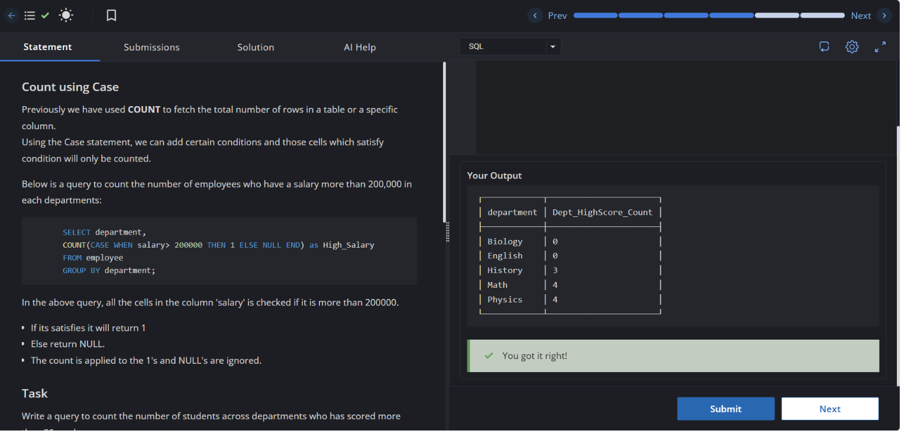

# Experiment 3.1

**Name:** Bhavesh Chawla  
**UID:** 24BCS10079

## Aim

To understand the use of the `COUNT` function with the `CASE` statement in SQL for counting records that satisfy a specific condition within each department.

---

## Question

Write an SQL query to count the number of students in each department who have scored **more than 90 marks** using the `COUNT` function with the `CASE` statement.

---

## Theory

The `COUNT()` function is used to count the number of records in a table. When combined with the `CASE` statement, it counts only those records that satisfy a given condition.

In this query:

- `CASE` checks whether the student's score is greater than **90**.
- If the condition is true, it returns **1**.
- Otherwise, it returns **NULL**.
- `COUNT()` counts only the non-NULL values.
- `GROUP BY` groups the records according to their department.

This method is useful for performing conditional counting in SQL.

---

# SQL Query Used

```sql
SELECT department,
COUNT(CASE WHEN score > 90 THEN 1 ELSE NULL END) AS Dept_HighScore_Count
FROM students
GROUP BY department;
```

---

# Output

```text
┌────────────┬──────────────────────┐
│ department │ Dept_HighScore_Count │
├────────────┼──────────────────────┤
│ Biology    │ 0                    │
│ English    │ 0                    │
│ History    │ 3                    │
│ Math       │ 4                    │
│ Physics    │ 4                    │
└────────────┴──────────────────────┘
```

---

## Output Screenshot



---

## Image Explanation

The screenshot shows the execution of an SQL query that uses the `COUNT` function along with the `CASE` statement to count students who have scored more than **90 marks** in each department. The output displays the number of high-scoring students department-wise after grouping the records using the `GROUP BY` clause.

---

## Result

The `COUNT()` function with the `CASE` statement was successfully used to count the number of students scoring more than **90 marks** in each department. The output correctly displays the department-wise count of high-scoring students.