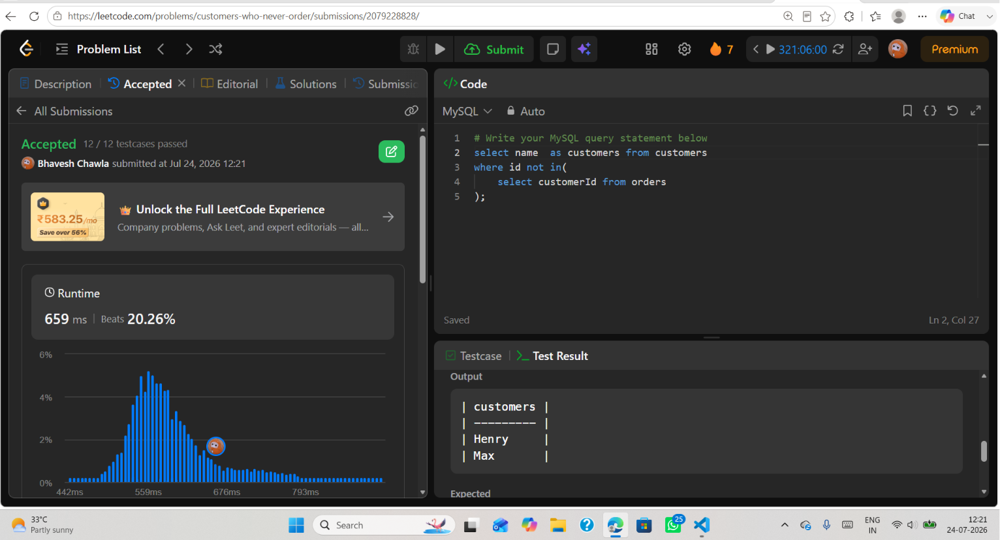

# Experiment 3.3

**Name:** Bhavesh Chawla  
**UID:** 24BCS10079

## Aim

To understand the use of the `NOT IN` operator in SQL to retrieve records that do not have matching values in another table.

---

## Question

Write an SQL query to find the names of customers who have **never placed an order** using the `NOT IN` operator.

---

## Theory

The `NOT IN` operator is used to retrieve records whose values are **not present** in the result of another query. It is commonly used with subqueries to filter records based on the absence of matching values.

In this query:

- The subquery retrieves all `customerId` values from the `Orders` table.
- The `NOT IN` operator compares each customer's `id` with those values.
- Customers whose IDs are not found in the `Orders` table are selected.
- The result displays only the names of customers who have never placed an order.

This method is useful for identifying records that do not have corresponding entries in another table.

---

# SQL Query Used

```sql
SELECT name AS Customers
FROM Customers
WHERE id NOT IN (
    SELECT customerId
    FROM Orders
);
```

---

# Output

```text
┌───────────┐
│ Customers │
├───────────┤
│ Henry     │
│ Max       │
└───────────┘
```

---

## Output Screenshot



---

## Image Explanation

The screenshot demonstrates the use of the `NOT IN` operator with a subquery. The subquery retrieves all customer IDs present in the `Orders` table, and the main query selects only those customers whose IDs are not included in that list. As a result, the output displays the names of customers who have never placed any orders.

---

## Result

The `NOT IN` operator was successfully used with a subquery to identify customers who have never placed an order. The output correctly displays the names of customers whose IDs are absent from the `Orders` table.