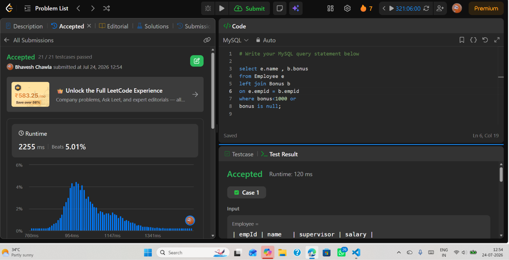

# Experiment 3.4

**Name:** Bhavesh Chawla  
**UID:** 24BCS10079

## Aim

To understand the use of the `LEFT JOIN` clause in SQL to retrieve employee names along with their bonus details, including employees who have not received any bonus.

---

## Question

Write an SQL query to report the **name** and **bonus** amount of each employee whose bonus is **less than 1000** or **has no bonus**.

---

## Theory

The `LEFT JOIN` clause is used to return all records from the left table (`Employee`) and the matching records from the right table (`Bonus`). If an employee has not received any bonus, the bonus value appears as `NULL`.

In this query:

- `LEFT JOIN` combines the `Employee` and `Bonus` tables using `empId`.
- The `WHERE` clause filters employees whose:
  - bonus is **less than 1000**, or
  - bonus is **NULL** (no bonus assigned).
- The query returns only the employee's **name** and **bonus**.

This approach is useful when records from the primary table must be displayed even if no matching record exists in the secondary table.

---

# SQL Query Used

```sql
SELECT e.name, b.bonus
FROM Employee e
LEFT JOIN Bonus b
ON e.empId = b.empId
WHERE b.bonus < 1000
   OR b.bonus IS NULL;
```

---

# Output

```text
┌─────────┬───────┐
│ name    │ bonus │
├─────────┼───────┤
│ Brad    │ NULL  │
│ John    │ NULL  │
│ Dan     │ 500   │
└─────────┴───────┘
```

---

## Output Screenshot



---

## Image Explanation

The screenshot shows the successful execution of the SQL query on LeetCode. The query uses the `LEFT JOIN` clause to combine the `Employee` and `Bonus` tables and displays employees whose bonus is less than **1000** or who have not received any bonus. The accepted result confirms that the query works correctly.

---

## Result

The `LEFT JOIN` clause was successfully used to retrieve employee names along with their bonus details. The query correctly displays employees whose bonus is less than **1000** or who do not have any bonus assigned.