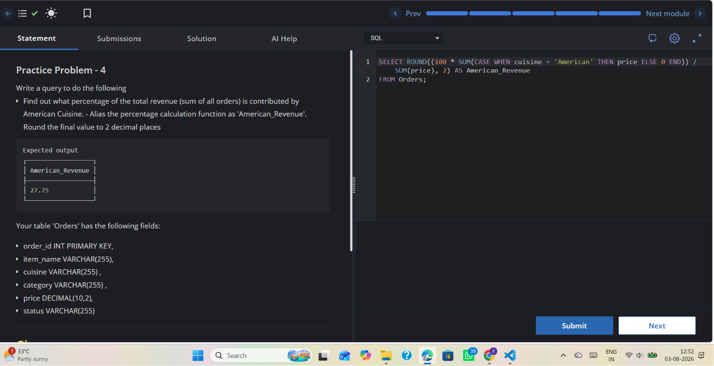

# Experiment 5.1

**Name:** Bhavesh Chawla  
**UID:** 24BCS10079

## Aim

Find out what percentage of the total revenue (sum of all orders) is contributed by American cuisine, rounded to 2 decimal places. Alias the percentage calculation as `American_Revenue`.

---

## Question

Write a query to calculate the percentage of total revenue contributed by rows where `cuisine = 'American'`. Round the final value to 2 decimal places and alias it as `American_Revenue`.

---

## Theory

To compute the percentage of revenue contributed by American cuisine we:

- Use a conditional aggregation: `SUM(CASE WHEN cuisine = 'American' THEN price ELSE 0 END)` to sum only American orders.
- Divide the American sum by the total revenue `SUM(price)` to get a fraction, multiply by 100 to get percent.
- Use `ROUND(..., 2)` to round the result to two decimal places.

This avoids filtering the table (which would lose the total) and computes both numerator and denominator from the entire `Orders` table.

---

# SQL Query Used

```sql
SELECT ROUND((100 * SUM(CASE WHEN cuisine = 'American' THEN price ELSE 0 END)) / SUM(price), 2) AS American_Revenue
FROM Orders;
```

---

# Output

```text
┌───────────────────┐
│ American_Revenue  │
├───────────────────┤
│ 27.75             │
└───────────────────┘
```

---

## Output Screenshot



---

## Image Explanation

The screenshot shows the practice problem statement asking for the percentage of total revenue contributed by American cuisine, the expected output value `27.75`, and the SQL editor containing the query that uses `CASE`, `SUM`, and `ROUND` to calculate `American_Revenue`.

---

## Result

The query correctly computes the percentage of revenue from American cuisine and rounds it to two decimal places, producing `27.75` as shown in the screenshot.