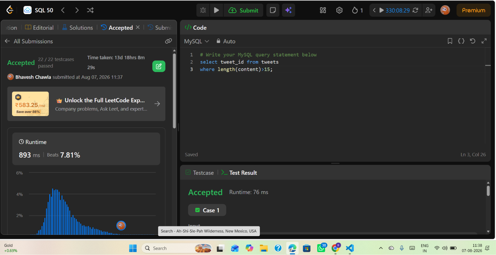

# Experiment 5.2

**Name:** Bhavesh Chawla  
**UID:** 24BCS10079

## Aim

Retrieve the `tweet_id` values for tweets whose `content` length is greater than 15 characters.

---

## Question

Write an SQL query that returns `tweet_id` from the `tweets` table where the length of the `content` column is more than 15 characters.

---

## Theory

Use the `LENGTH()` (or `CHAR_LENGTH()` depending on SQL dialect) function to measure the number of characters in the `content` column. Applying a `WHERE` filter `LENGTH(content) > 15` returns only those rows meeting the length requirement.

This is useful for filtering by text size, e.g., to find longer posts/messages.

---

# SQL Query Used

```sql
select tweet_id from tweets
where length(content) > 15;
```

---

# Output

The submission shown in the screenshot was accepted on the coding platform (all test cases passed). The query returns the `tweet_id` values for tweets with `content` longer than 15 characters.

---

## Output Screenshot



---

## Image Explanation

The screenshot shows a coding-platform submission: the SQL code in the editor (`select tweet_id from tweets where length(content) > 15;`), and the submission status marked as **Accepted** with test cases passed. Runtime statistics and acceptance details are visible in the left and bottom panels of the screenshot.

---

## Result

The query correctly selects `tweet_id` values for tweets where the `content` length exceeds 15 characters; the submission was accepted by the platform as shown.