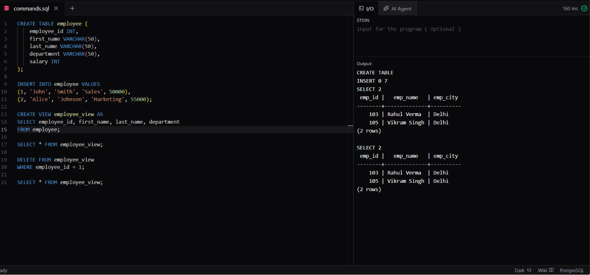

# Experiment 6.1

**Name:** Bhavesh Chawla  
**UID:** 24BCS10079

## Aim

To create a view on the `employee` table, retrieve its data, and delete a row through the view.

## Question

Create an `employee` table, insert employee records, create a view containing selected columns, display the view data, and delete the employee whose `employee_id` is `1` through the view.

## Theory

 A view is a virtual table based on the result of a query. A simple view based on one table can be updatable, allowing `DELETE` operations on the view to affect the underlying table.

## SQL Query Used

```sql
CREATE TABLE employee (
    employee_id INT,
    first_name VARCHAR(50),
    last_name VARCHAR(50),
    department VARCHAR(50),
    salary INT
);

INSERT INTO employee VALUES
(1, 'John', 'Smith', 'Sales', 50000),
(2, 'Alice', 'Johnson', 'Marketing', 55000);

CREATE VIEW employee_view AS
SELECT employee_id, first_name, last_name, department
FROM employee;

SELECT * FROM employee_view;

DELETE FROM employee_view
WHERE employee_id = 1;

SELECT * FROM employee_view;
```

## Output

The first `SELECT` displays both employees. After deleting through the view, the second `SELECT` displays only employee `2`, Alice Johnson.

## Output Screenshot



## Image Explanation

The screenshot shows the table creation, employee records, view definition, initial view output, deletion through `employee_view`, and the final output after employee `1` has been removed.

## Result

The view was created successfully, and the delete operation removed the matching row from the underlying `employee` table through the view.