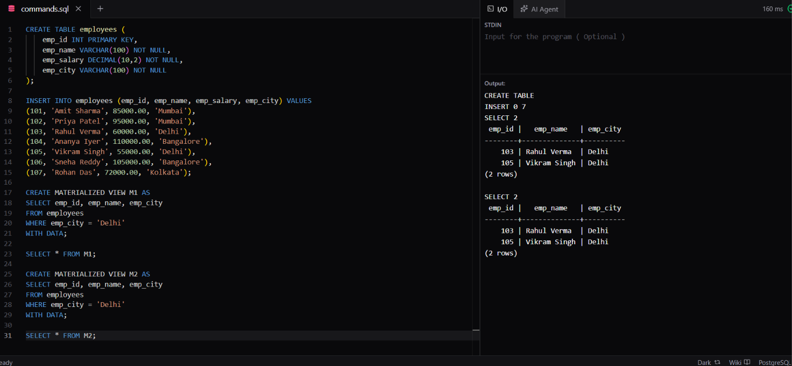

# Experiment 6.2

**Name:** Bhavesh Chawla  
**UID:** 24BCS10079

## Aim

To create and query materialized views containing employees from a selected city.

## Question

Create an `employees` table, insert employee records, create materialized views for employees from Delhi, and display the stored results.

## Theory

A materialized view stores the result of its defining query. `WITH DATA` populates the materialized view immediately when it is created. Unlike a normal view, its result is stored and must be refreshed when the underlying data changes.

## SQL Query Used

```sql
CREATE TABLE employees (
    emp_id INT PRIMARY KEY,
    emp_name VARCHAR(100) NOT NULL,
    emp_salary DECIMAL(10,2) NOT NULL,
    emp_city VARCHAR(100) NOT NULL
);

INSERT INTO employees (emp_id, emp_name, emp_salary, emp_city) VALUES
(101, 'Amit Sharma', 85000.00, 'Mumbai'),
(102, 'Priya Patel', 95000.00, 'Mumbai'),
(103, 'Rahul Verma', 60000.00, 'Delhi'),
(104, 'Ananya Iyer', 110000.00, 'Bangalore'),
(105, 'Vikram Singh', 55000.00, 'Delhi'),
(106, 'Sneha Reddy', 105000.00, 'Bangalore'),
(107, 'Rohan Das', 72000.00, 'Kolkata');

CREATE MATERIALIZED VIEW M1 AS
SELECT emp_id, emp_name, emp_city
FROM employees
WHERE emp_city = 'Delhi'
WITH DATA;

SELECT * FROM M1;

CREATE MATERIALIZED VIEW M2 AS
SELECT emp_id, emp_name, emp_city
FROM employees
WHERE emp_city = 'Delhi'
WITH DATA;

SELECT * FROM M2;
```

## Output

Both materialized views return the two Delhi employees: Rahul Verma (`103`) and Vikram Singh (`105`).

## Output Screenshot



## Image Explanation

The screenshot shows the `employees` table data, the definitions of materialized views `M1` and `M2`, and the results of querying both views for employees whose city is Delhi.

## Result

The materialized views were created and populated successfully, and both returned the expected Delhi employee records.