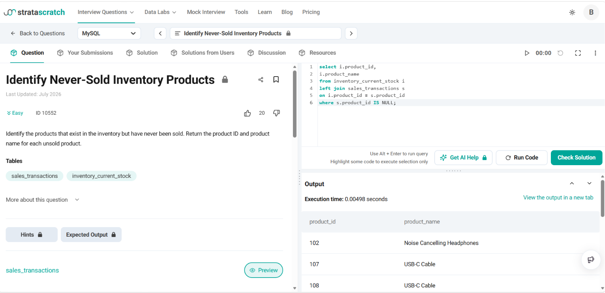

# Identify Never-Sold Inventory Products

**Name:** Bhavesh Chawla  
**UID:** 24BCS10079

## Aim

To identify the products that are available in the inventory but have never been sold using SQL joins.

---

## Question

Given the following tables:

- **sales_transactions**
- **inventory_current_stock**

Write an SQL query to identify the products that exist in the inventory but have **never been sold**. Return the **product ID** and **product name** for each unsold product.

---

## Approach

Since every product in the inventory should be considered, we use a **LEFT JOIN** between the `inventory_current_stock` table and the `sales_transactions` table.

- The **LEFT JOIN** keeps all products from the inventory.
- If a product has never been sold, there will be **no matching record** in the `sales_transactions` table.
- Such rows contain **NULL** values for the sales table columns.
- Therefore, filtering using `WHERE s.product_id IS NULL` returns only the unsold products.

---

# SQL Query

```sql
SELECT
    i.product_id,
    i.product_name
FROM inventory_current_stock i
LEFT JOIN sales_transactions s
ON i.product_id = s.product_id
WHERE s.product_id IS NULL;
```

---

# Explanation

- `inventory_current_stock` is used as the **left table** because it contains all available products.
- `sales_transactions` is joined to check whether each product has been sold.
- `LEFT JOIN` ensures that every inventory product appears in the result.
- Products without a matching sales record have `NULL` values in the joined table.
- The condition

```sql
WHERE s.product_id IS NULL;
```

filters only those products that have never been sold.

---

# Output

| product_id | product_name |
|------------|------------------------------|
| 102 | Noise Cancelling Headphones |
| 107 | USB-C Cable |
| 108 | USB-C Cable |

---

# Output Screenshot

<p align="center">
    
</p>

---

# Image Explanation

The screenshot shows the successful execution of the SQL query. The query performs a **LEFT JOIN** between the inventory and sales tables and filters rows where no matching sales record exists. The output displays the **product ID** and **product name** of all inventory products that have never been sold.

---

# Result

The required SQL query was executed successfully. Using **LEFT JOIN** and the `IS NULL` condition, the products that exist in the inventory but have never been sold were identified successfully.