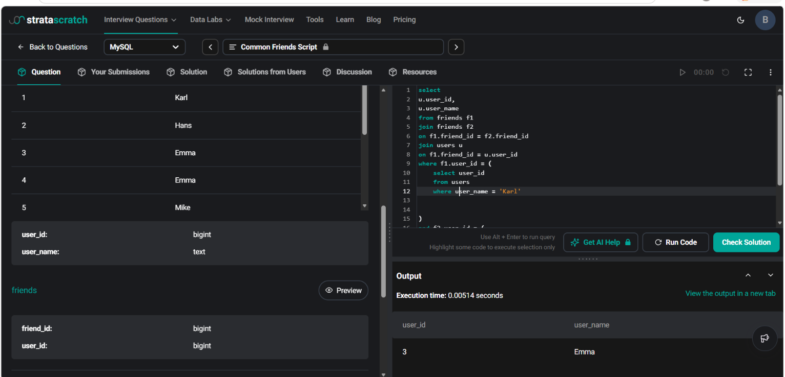

# Common Friends Script

**Name:** Bhavesh Chawla  
**UID:** 24BCS10079

## Aim

To identify the mutual friends between two users, **Karl** and **Hans**, using SQL joins.

---

## Question

You are analyzing a social network dataset at Google. Your task is to find the **common (mutual) friends** between two users, **Karl** and **Hans**.

There is only one user named **Karl** and one user named **Hans** in the dataset.

Return the following columns:

- `user_id`
- `user_name`

---

## Tables Used

### users

| Column | Description |
|---------|-------------|
| user_id | Unique ID of the user |
| user_name | Name of the user |

### friends

| Column | Description |
|---------|-------------|
| user_id | User ID |
| friend_id | Friend ID |

---

# Approach

The solution uses a **Self Join** on the `friends` table.

1. Find Karl's `user_id`.
2. Find Hans' `user_id`.
3. Retrieve the friend list of Karl.
4. Retrieve the friend list of Hans.
5. Join the `friends` table with itself on `friend_id` to identify common friends.
6. Join the `users` table to obtain the names of the common friends.

---

# SQL Query

```sql
SELECT
    u.user_id,
    u.user_name
FROM friends f1
JOIN friends f2
    ON f1.friend_id = f2.friend_id
JOIN users u
    ON f1.friend_id = u.user_id
WHERE f1.user_id = (
    SELECT user_id
    FROM users
    WHERE user_name = 'Karl'
)
AND f2.user_id = (
    SELECT user_id
    FROM users
    WHERE user_name = 'Hans'
);
```

---

# Explanation

- `friends` is joined with itself to compare Karl's friend list with Hans' friend list.
- The condition

```sql
f1.friend_id = f2.friend_id
```

ensures that only mutual friends are selected.

- The `users` table is joined to obtain the corresponding user names.
- Subqueries are used to dynamically fetch the IDs of **Karl** and **Hans**, avoiding hardcoding user IDs.

---

# Output

| user_id | user_name |
|---------|-----------|
| 3 | Emma |

---

# Output Screenshot

<p align="center">
    
</p>

---

# Image Explanation

The screenshot shows the successful execution of the SQL query. The `friends` table is self-joined to compare the friend lists of **Karl** and **Hans**. The result identifies **Emma** as the only mutual friend shared by both users.

---

# Result

The SQL query was executed successfully using a **Self Join** on the `friends` table. The common friend between **Karl** and **Hans** was identified correctly, and the required `user_id` and `user_name` were returned.
```