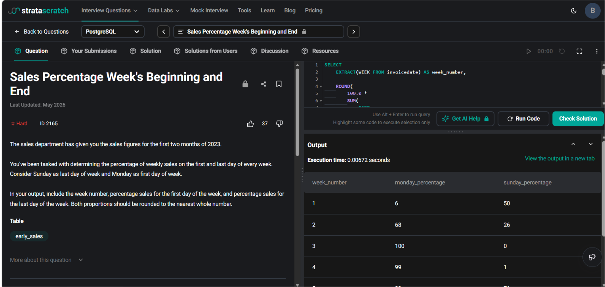

# Sales Percentage Week's Beginning and End

**Name:** Bhavesh Chawla  
**UID:** 24BCS10079

## Aim

To calculate the percentage of weekly sales made on the **first day (Monday)** and the **last day (Sunday)** of each week using SQL aggregate functions and conditional aggregation.

---

## Question

The sales department has provided the sales figures for the first two months of **2023**.

Determine the percentage of weekly sales that occurred on:

- **Monday (first day of the week)**
- **Sunday (last day of the week)**

Assume:

- Monday is the first day of the week.
- Sunday is the last day of the week.

Return the following columns:

- `week_number`
- `monday_percentage`
- `sunday_percentage`

Both percentages should be rounded to the nearest whole number.

---

## Table Used

### early_sales

| Column | Data Type |
|---------|-----------|
| invoicedate | date |
| invoiceno | bigint |
| quantity | bigint |
| stockcode | character varying |
| unitprice | double precision |

---

# Approach

The total sales for each transaction are calculated as:

```text
Sales = Quantity × UnitPrice
```

The solution follows these steps:

1. Extract the week number using `EXTRACT(WEEK FROM invoicedate)`.
2. Calculate total weekly sales.
3. Calculate Monday sales using conditional aggregation.
4. Calculate Sunday sales using conditional aggregation.
5. Compute the percentage of Monday and Sunday sales relative to the total weekly sales.
6. Round the percentages to the nearest whole number.

---

# SQL Query

```sql
SELECT
    EXTRACT(WEEK FROM invoicedate) AS week_number,

    ROUND(
        100.0 *
        SUM(
            CASE
                WHEN EXTRACT(DOW FROM invoicedate) = 1
                THEN quantity * unitprice
                ELSE 0
            END
        )
        /
        SUM(quantity * unitprice)
    ) AS monday_percentage,

    ROUND(
        100.0 *
        SUM(
            CASE
                WHEN EXTRACT(DOW FROM invoicedate) = 0
                THEN quantity * unitprice
                ELSE 0
            END
        )
        /
        SUM(quantity * unitprice)
    ) AS sunday_percentage

FROM early_sales

GROUP BY EXTRACT(WEEK FROM invoicedate)

ORDER BY week_number;
```

---

# Explanation

- `EXTRACT(WEEK FROM invoicedate)` groups all records by week number.
- `EXTRACT(DOW FROM invoicedate)` returns the day of the week:
  - **0 = Sunday**
  - **1 = Monday**
- Sales are calculated as:

```text
quantity × unitprice
```

- Conditional aggregation computes Monday and Sunday sales separately.
- The percentage is calculated as:

```text
(Day Sales / Total Weekly Sales) × 100
```

- `ROUND()` rounds the percentages to the nearest whole number.

---

# Output

| week_number | monday_percentage | sunday_percentage |
|-------------|------------------:|------------------:|
| 1 | 6 | 50 |
| 2 | 68 | 26 |
| 3 | 100 | 0 |
| 4 | 99 | 1 |
| 5 | 29 | 71 |

---

# Output Screenshot

<p align="center">
    
</p>

---

# Image Explanation

The screenshot displays the successful execution of the SQL query. The output shows the **week number** along with the percentage of total weekly sales that occurred on **Monday** and **Sunday**. The percentages are calculated using conditional aggregation and rounded to the nearest whole number.

---

# Result

The SQL query was executed successfully. The percentage of weekly sales occurring on the **first day (Monday)** and the **last day (Sunday)** for each week was calculated correctly using PostgreSQL aggregate functions, conditional aggregation, and date extraction functions.